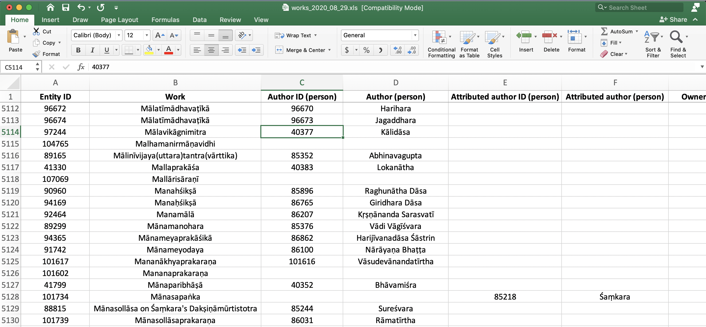
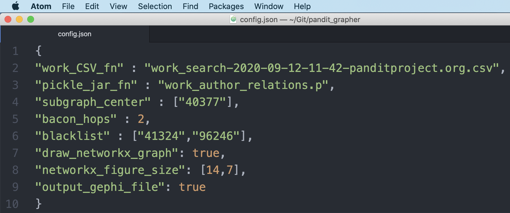
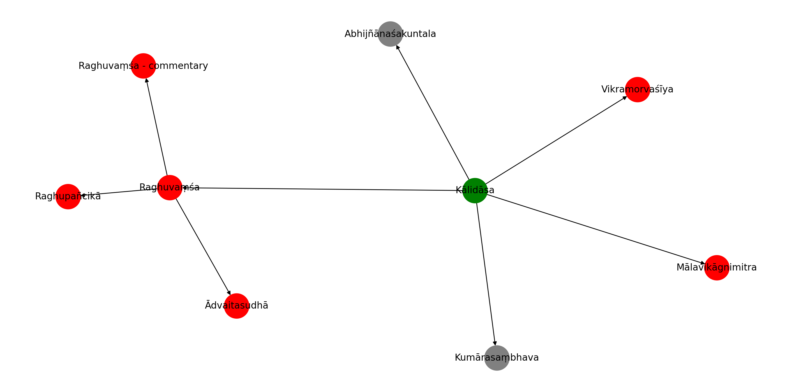
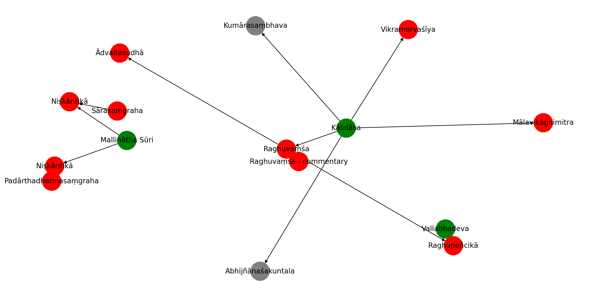
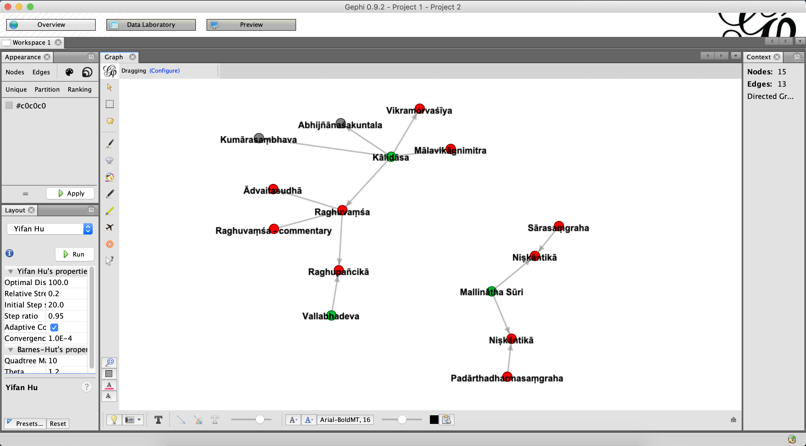
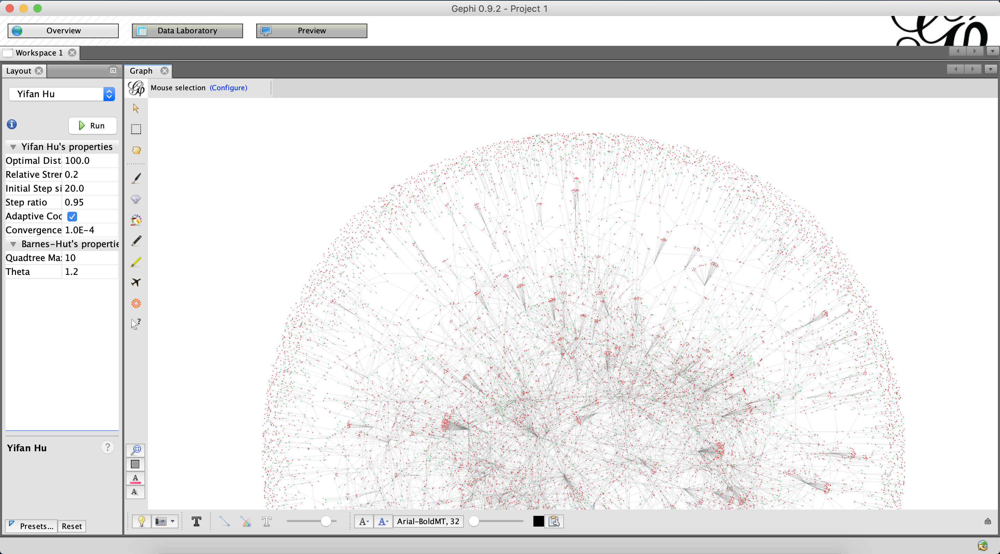
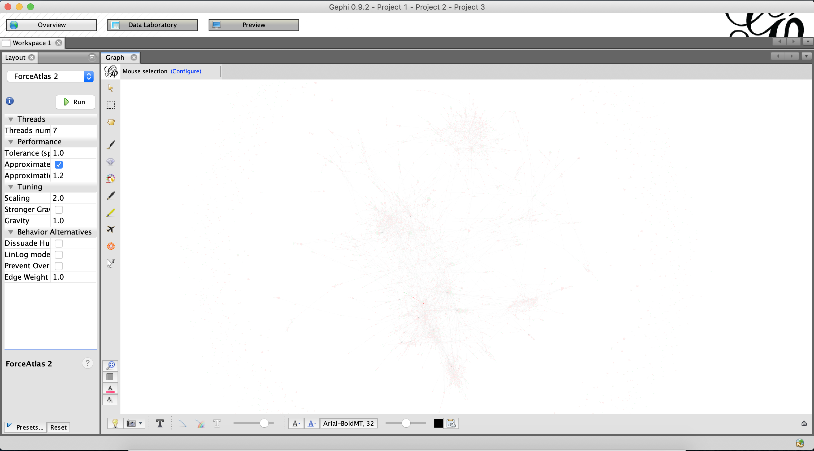

# pandit_grapher

Graphs person-work and work-work relationships in the [Pandit Project](https://www.panditproject.org/) prosophographical database.

This can be useful both for exploring certain persons or works of interest and for more quickly finding Pandit Project items in need of improvement.

# Requirements

Python 3.

Currently using `networkx` package both for creating the graph structure and for drawing basic visuals. This relies on `matplotlib` and (for more complex cases) `scipy`.

If you like, you can also download and use [Gephi](https://gephi.org/), for which basic output is also supported here.

# Preparing the Data

1. Download or clone the repository.

2. Download an up-to-date Pandit "Works" CSV file (Sept 2020: 3.1mb; [see here](https://www.panditproject.org/node/99329) for instructions) and place it in the repository directory. Alternatively, simply use the included snapshot (`work_search-2020-09-12-11-42-panditproject.org.csv`).

> Note: `pandit_grapher` currently recreates its own "Person" data from the "Works" download. Other entity types (incl. "Persons", "Sites", "Institutions", "States", "Manuscripts", "Extracts", and "Print Sources") and other "Works" information (e.g., family relations) are currently ignored, since I wasn't yet personally interested, but the code can easily be extended as needed (e.g., to distinguish between “Authors” and “Attributed Authors”, graph known geospatial information, etc., etc.)

3. In the downloaded or cloned `pandit_grapher` repository, open `config.json` with a text editor (preferably one that shows JSON nicely, like Atom, Sublime, or BBEdit). You'll be using it as a dashboard for managing all settings.

3. Make sure that the `work_CSV_fn` variable in `config.json` is set to the correct filename.

4. Run the `brush_and_floss` module with no arguments to clean the data.

~~~
python brush_and_floss.py
~~~

The resulting pickle file (e.g., `work_person_relations.p`) in the `pandit_grapher` directory is what the `grapher` module will draw its work and person data from.

# Running the `grapher` Module

The `grapher` module builds a subgraph (or multiple subgraphs) of the Pandit network centered on a desired entity or entities.

1. Using the Pandit website (or the downloaded data), identify the entity ID number of a Person or Work you are interested in. Then, in `config.json`, use this number, as a string, to populate the list variable `subgraph_center`. (The default value is a single entity, `"40377"`, for [Kālidāsa](https://www.panditproject.org/entity/40377/person). You can also use multiple entities in this list, with a separate string for each, as demonstrated in the screenshots below.)

2. Set the `bacon_hops` to an integer indicating the number of hops outward from the `subgraph_center` entity to graph (cp. ["Six Degrees of Kevin Bacon"](https://en.wikipedia.org/wiki/Six_Degrees_of_Kevin_Bacon#:~:text=Six%20Degrees%20of%20Kevin%20Bacon%20or%20%22Bacon's%20Law%22%20is%20a,and%20prolific%20actor%20Kevin%20Bacon) and the ["Oracle of Bacon"](https://oracleofbacon.org/)). E.g., `0` means graph the center entity only, `1` means graph one more layer of connections after that, `2` means two more, etc. (The default is `2`.)

> Note: Excluding isolate nodes and subgraphs, the lion's share of the entire graph of Pandit Works and Persons (specifically, 8,168 out of 14,677) is spanned usually within 20–30 hops outward, depending on the starting point. By contrast, for the purpose of simple visual inspection, 3–5 hops will be the most common choice, as anything more than that can quickly become uncomfortably complicated to look at in the absence of careful filtering (for which, see "blacklisting" directly below).

3. Set the `blacklist` variable in `config.json` to a list of strings representing entity IDs (Person and/or Work) whose further connections should be suppressed in building the subgraph(s). Use this when, for example, a given author is too prolific or a given work is too commented-upon and would therefore overwhelm other information in the visualization. (The default list is `["41324","96246"]`, suppressing further connections on [Kumārasaṃbhava](https://www.panditproject.org/entity/41324/work) and [Abhijñānaśakuntala](https://www.panditproject.org/entity/96246/work), respectively.)

4. Run the `grapher` module on the command-line with no arguments.

~~~
python grapher.py
~~~

The resulting graph is created in memory, (optionally) drawn to the screen with `networkx`, and also (optionally) output for Gephi.

# How to Read the `networkx` Results

If the `draw_networkx_graph` variable is set to `true` in `config.json`, an OS-native `networkx` pop-up window will appear with a “spring”-type, force-directed graph. Green circles are for persons, red circles are for works. Grey circles are for either persons or works whose further connections have been suppressed by the `blacklist`. Lines indicate authorship or commentarial relationships, and arrows indicate causality, i.e., that a person "wrote" a work, or that one work "inspired" a further commentarial work.

It's also fine to use multiple entities to seed the `subgraph_center`. As long as there aren't errors or gaps in the database itself, the graph should connect itself up just fine. (Below is an example of doing so with Kālidāsa (ID: 40377), Vallabhadeva (ID: 96590), and Mallinātha Sūri (ID: 85731). In this case, we see that Potter's database, on which Pandit Project is based, excluded most non-śāstric works, including Mallinātha's commentaries on Kālidāsa's *kāvya* works. This would therefore be a good opportunity for growing the Pandit database in that direction.) 

# Using the Gephi Output File

If the `output_gephi_file` variable is set to `true` in `config.json`, an additional `.gexf` file compatible with the free third-party visualization software [Gephi](https://gephi.org/) will be generated in the `pandit_grapher` directory. This can be simply be opened in Gephi (`File` > `Open`) for more flexible graph visualization and manipulation there. For example, the “Yifan Hu” layout will produce a similar force-directed graph, and fiddling with the node, edge, and label appearances can quickly exceed what `networkx` can produce. The parts of the graph can also be moved around manually. The software has an active user community, making it easy to find answers to questions online.

# Doing Other Things with the Graph Data

The above calculation of the number of hops required to span the overall Pandit network is an example of doing things with the graph data other than just outputting parts of it for manual inspection. For more such analysis, optionally set the `draw_networkx_graph` and `output_gephi_file` variables in `config.json` to `false` and then just proceed to make use of the internal `networkx` graph object returned by `grapher.construct_subgraph()` and perhaps also the `grapher.Entities_by_id` dictionary which maps Pandit entity ID numbers to objects of the type defined in the `objects` module. For example, in Python interactive mode:

~~~
>>> import grapher as gr
>>> PG = gr.construct_subgraph(gr.subgraph_center, gr.bacon_hops, gr.blacklist)
>>> print(PG.edges()) # PG = Pandit_Graph
[('40377', '96246'), ('40377', '41324'), ('40377', '97244'), ('40377', '41500'), ('40377', '97243'), ('41500', '41499'), ('41500', '96592'), ('41510', '41500')]
>>>
>>> def summarize_building_of_n_hop_graph(sbgrph_ctr, hops, blcklst):
...     PG = gr.construct_subgraph(sbgrph_ctr, hops, blcklst)
...     last_node_id = list(PG.nodes)[-1]
...     last_node_str = "(last node: %s %s)" % (last_node_id, gr.Entities_by_id[last_node_id].name)
...     print(hops, len(PG.nodes()), last_node_str)
... 
>>> for num_hops in range(15):
...     summarize_building_of_n_hop_graph(gr.subgraph_center, num_hops, blcklst=[])
... 
0 1 (last node: 40377 Kālidāsa)
1 6 (last node: 97243 Vikramorvaśīya)
2 14 (last node: 96247 Abhijñānaśakuntalaṭīkā)
3 19 (last node: 96241 Pūrṇasarasvatī)
4 53 (last node: 96388 Yuddhakāṇḍa)
5 59 (last node: 96381 Ḍamarukavyākhyānam)
6 68 (last node: 96677 Vibudharatnāvalī)
7 184 (last node: 88699 Yogatārāvalī)
8 422 (last node: 90982 Subodhinī on Śaṃkara's Hastāmalakakīyabhāṣya)
9 980 (last node: 85963 Govinda Śeṣa)
10 1932 (last node: 97941 Āryāpañcāśīti)
11 3061 (last node: 100791 Brahmādarśa)
12 4109 (last node: 41242 Kāvyaprakāśa)
13 5307 (last node: 91179 Ṭīkā on the Gacchācaraprakīrṇaka)
14 6019 (last node: 88071 Amitābhavyūhasūtra)
~~~

# Visualizing the Full Graph in Gephi

To contruct the entire graph for visualization in Gephi, simply run the module `construct_full_graph`. 

~~~
python construct_full_graph.py
~~~

This script mainly consists of a long list of individual node ID numbers, one for each subgraph, including all isolate nodes. 

> (Note: the main subgraph contains 8281 nodes. 432 nodes occur in subgraphs of double-digit numbers of nodes. 1320 and 2344 occur in 3-node and 2-node subgraphs, respectively. 2370 nodes are isolates. This totals 14747 nodes.)

When this list is used to seed the graph construction process, and enough hops are ensured for the Kālidāsa seed node of the main subgraph, the result is the entire graph. It should take less than a minute to build on a fast machine.

Once constructed, the graph can be fruitfully visualized with the Yifan Hu and Force Atlas 2 layout algorithms in Gephi. (Other algorithms tend not to be as effective.)

# Feedback, License

Hit me up! Let me know if this is useful, whether you'd like changes, etc. And share and share alike: licensed under a [Creative Commons Attribution-ShareAlike 4.0 International License](https://creativecommons.org/licenses/by-sa/4.0/).