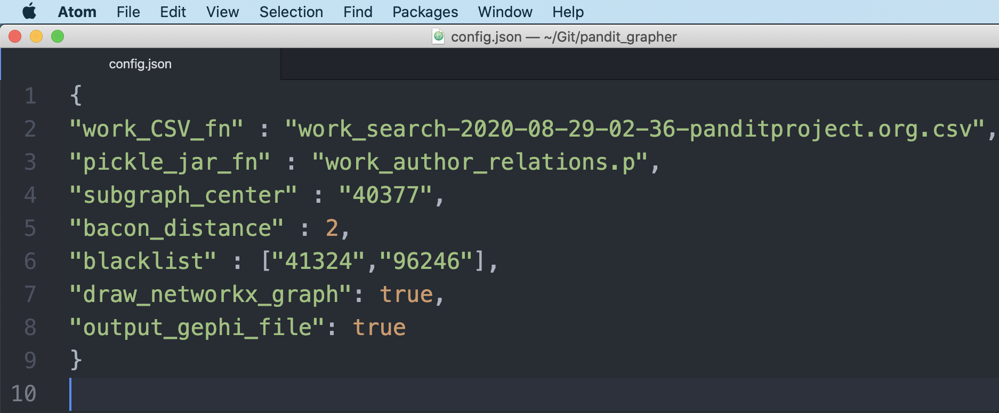

# pandit_grapher

Graphs prosophographical relationships in [Pandit](https://www.panditproject.org/) database.

# Requirements

Python 3.

Currently using `networkx` package both for creating graph structure and for drawing visuals. I hope to soon move onto something else for nicer visuals.

# Preparing the Data

1. Download the up-to-date Pandit info on "Works" as a CSV file (Aug 2020: 3.1mb); [see here](https://www.panditproject.org/node/99329) for instructions. Alternatively, simply use the snapshot included in the repository here (`work_search-2020-08-29-02-36-panditproject.org.csv`).

> Note: `pandit_grapher` currently doesn't do anything with information from other Pandit entity categories ("Persons", "Sites", "Institutions", "States", "Manuscripts", "Extracts", and "Print Sources"), and it also ignores much of the information for "Works" because I was not yet personally interested in doing anything with these things, but the code can easily be extended to treat any number of these as needed (e.g., with new color dots, etc.)

2. Run the `brush_and_floss` module on the downloaded CSV file to clean the data.

~~~
python brush_and_floss.py work_search-2020-08-29-02-36-panditproject.org.csv
~~~

The resulting pickle file (`work_person_relations.p`) is what the `grapher` module will draw its work and person data from.

# Running the `grapher` Module

1. Open `config.json` with a text editor. You'll be using it as a dashboard for managing run settings.

2. Identify the Pandit ID number of a Person or Work you are interested in. (This is also available on the individual Pandit entity page.) Enter it as the `subnetwork_center` variable (a string) in `config.json`. (The default value is `"40377"` for [Kālidāsa](https://www.panditproject.org/entity/40377/person).)

3. Set the `bacon_distance` to an integer indicating the number of iterations outward from the seed entity to graph (cp. ["Six Degrees of Kevin Bacon"](https://en.wikipedia.org/wiki/Six_Degrees_of_Kevin_Bacon#:~:text=Six%20Degrees%20of%20Kevin%20Bacon%20or%20%22Bacon's%20Law%22%20is%20a,and%20prolific%20actor%20Kevin%20Bacon) and the ["Oracle of Bacon"](https://oracleofbacon.org/)). E.g., `0` means graph the center entity only, `1` means graph one more layer of connections after that, `2` means two more, etc. (The default is `2`.)

3. Set the `blacklist` variable in `config.json` to a list of strings representing entity IDs (Person and/or Work) whose further connections should be suppressed in graphing. Use this when, for example, a given author is too prolific or a given work is too commented-upon and would therefore visually overwhelm other information in the graph. (The default list is `["41324","96246"]` in order to suppress further connections on Kumārasaṃbhava and Abhijñānaśakuntala.)

4. Run the `grapher` module on the command-line with no arguments.

~~~
python grapher.py
~~~

# How to Read the networkx Results

If the `draw_networkx_graph` variable is set to `true` in `config.json`, an OS-native `networkx` pop-up window will appear. Green circles are for persons, red circles are for works. Grey circles are for either persons or works whose further connections have been suppressed by the `blacklist`. Lines indicate authorship or commentarial relationships, and arrows indicate causality, i.e., that a person "wrote" a work, or that one work "inspired" a further commentarial work.

# Using the Gephi Output File

If the `output_gephi_file` variable is set to `true` in `config.json`, an additional file compatible with the free third-party visualization software Gephi (`.gexf`) will be generated in the `pandit_grapher` directory. This can be simply be opened in Gephi (`File` > `Open`) for more flexible graph visualization and manipulation there.

# Feedback, License

Hit me up! Let me know if this is useful, whether you'd like changes, etc. And share and share alike:

This work is licensed under a [Creative Commons Attribution-ShareAlike 4.0 International License](https://creativecommons.org/licenses/by-sa/4.0/).