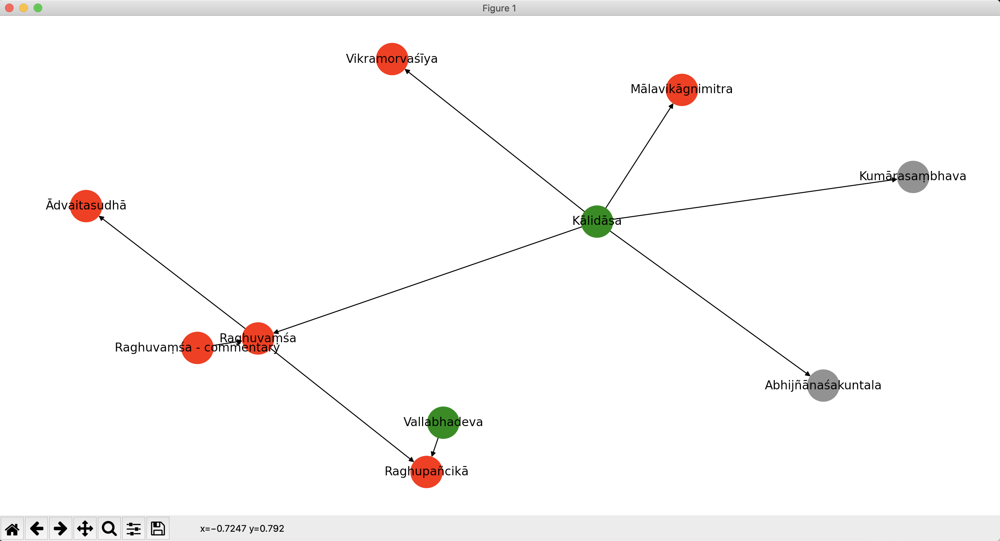
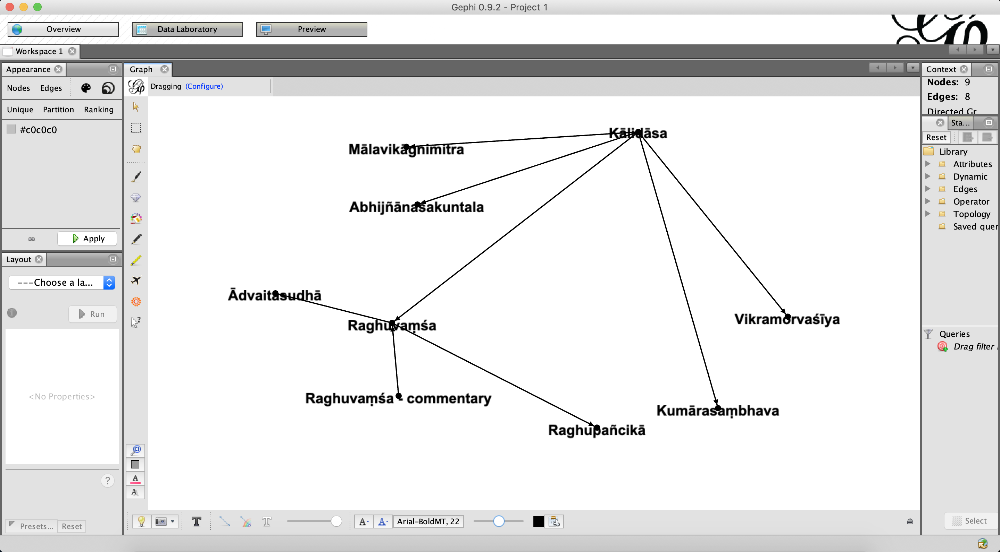

# pandit_grapher

Graphs person-work and work-work relationships in the [Pandit Project](https://www.panditproject.org/) prosophographical database.

# Requirements

Python 3.

Currently using `networkx` package both for creating the graph structure and for drawing basic visuals.

If you like, you can also use [Gephi](https://gephi.org/), for which basic output is also supported.

# Preparing the Data

1. Download the up-to-date Pandit info on "Works" as a CSV file (Aug 2020: 3.1mb); [see here](https://www.panditproject.org/node/99329) for instructions. Alternatively, simply use the snapshot included in the repository here (`work_search-2020-08-29-02-36-panditproject.org.csv`).

> Note: `pandit_grapher` currently doesn't do anything with information from other Pandit entity categories ("Persons", "Sites", "Institutions", "States", "Manuscripts", "Extracts", and "Print Sources"), and it also ignores much of the information for "Works" because I was not yet personally interested in doing anything with these things, but the code can easily be extended to treat any number of these as needed (e.g., with new color dots, etc.)

2. Open `config.json` with a text editor. You'll be using it as a dashboard for managing all settings.

3. Make sure that the `work_CSV_fn` variable in `config.json` is set to the correct filename.

4. Run the `brush_and_floss` module with no arguments to clean the data.

~~~
python brush_and_floss.py
~~~

The resulting pickle file (e.g., `work_person_relations.p`) in the `pandit_grapher` directory is what the `grapher` module will draw its work and person data from.

# Running the `grapher` Module

1. In `config.json`, identify the Pandit ID number of a Person or Work you are interested in. (This is also available on the individual Pandit entity page.) Add this number, as a string, to the list variable `subnetwork_center`. (The default value is a single entity, `"40377"`, for [Kālidāsa](https://www.panditproject.org/entity/40377/person). You can also use multiple entities, as demonstrated in the screenshots below.)

2. Set the `bacon_distance` to an integer indicating the number of iterations outward from the seed entity to graph (cp. ["Six Degrees of Kevin Bacon"](https://en.wikipedia.org/wiki/Six_Degrees_of_Kevin_Bacon#:~:text=Six%20Degrees%20of%20Kevin%20Bacon%20or%20%22Bacon's%20Law%22%20is%20a,and%20prolific%20actor%20Kevin%20Bacon) and the ["Oracle of Bacon"](https://oracleofbacon.org/)). E.g., `0` means graph the center entity only, `1` means graph one more layer of connections after that, `2` means two more, etc. (The default is `2`.)

> Note: Excluding isolate nodes that don't connect to anything else, the number of iterations required to start from any one node and span the entire graph is approximately .... However, if you're interested in visually inspecting individual entities, depending on the individual, anything more than 3–5 iterations can quickly get too complicated to look at without significant filtering (see "blacklisting" below).

3. Set the `blacklist` variable in `config.json` to a list of strings representing entity IDs (Person and/or Work) whose further connections should be suppressed in building the subgraph. Use this when, for example, a given author is too prolific or a given work is too commented-upon and would therefore visually overwhelm other information in the graph. (The default list is `["41324","96246"]` in order to suppress further connections on [Kumārasaṃbhava](https://www.panditproject.org/entity/41324/work) and [Abhijñānaśakuntala](https://www.panditproject.org/entity/96246/work), respectively.)

4. Run the `grapher` module on the command-line with no arguments.

~~~
python grapher.py
~~~

# How to Read the networkx Results

If the `draw_networkx_graph` variable is set to `true` in `config.json`, an OS-native `networkx` pop-up window will appear. Green circles are for persons, red circles are for works. Grey circles are for either persons or works whose further connections have been suppressed by the `blacklist`. Lines indicate authorship or commentarial relationships, and arrows indicate causality, i.e., that a person "wrote" a work, or that one work "inspired" a further commentarial work.

You can also use multiple entities to seed the `subgraph_center`. Below is an example of doing so with both Kālidāsa and Vallabhadeva. As long as there aren't errors in the database itself, the graph should connect itself up just fine.

# Using the Gephi Output File

If the `output_gephi_file` variable is set to `true` in `config.json`, an additional file (`.gexf`) compatible with the free third-party visualization software [Gephi](https://gephi.org/) will be generated in the `pandit_grapher` directory. This can be simply be opened in Gephi (`File` > `Open`) for more flexible graph visualization and manipulation there.

# Doing Other Things with the Graph Data

The above calculation of the number of iterations required to span the entire graph is an example of doing other things with that graph than outputting for direct visualization. To do more such things, optionally set the `draw_networkx_graph` and `output_gephi_file` variables to `false` in `config.json` and then just proceed to use the internal graph object returned by `grapher.construct_graph()`. For example, in Python interactive mode:

~~~
\>\>\> import grapher
\>\>\> PG = grapher.construct_subgraph()
\>\>\> print(PG.edges())
[('40377', '96246'), ('40377', '41324'), ('40377', '97244'), ('40377', '41500'), ('40377', '97243'), ('41500', '41499'), ('41500', '96592'), ('41510', '41500')]
\>\>\> def graph_to(i):
\>\>\> 		grapher.bacon_distance = i
\>\>\> 		PG = grapher.construct_subgraph()
\>\>\> 		print(i, len(PG.nodes()) )
\>\>\> for i in range(30):
...     	graph_to(i)
0 1
1 6
2 14
3 19
4 53
5 59
6 68
7 184
8 422
9 980
10 1932
...
~~~

# Feedback, License

Hit me up! Let me know if this is useful, whether you'd like changes, etc. And share and share alike: licensed under a [Creative Commons Attribution-ShareAlike 4.0 International License](https://creativecommons.org/licenses/by-sa/4.0/).