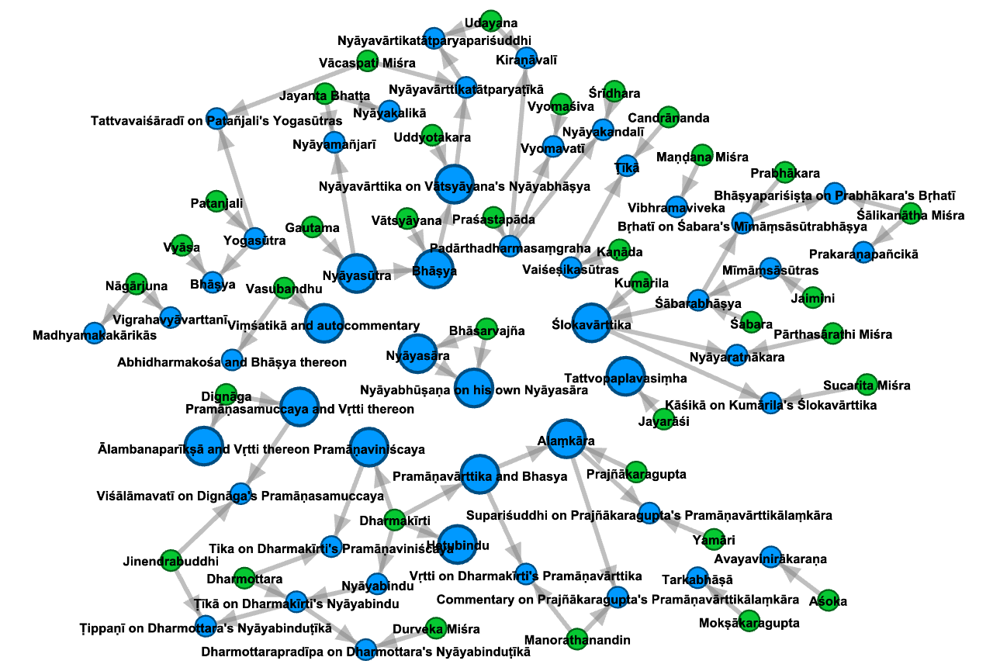

# How to Read local `networkx` Results

If the `draw_networkx_graph` variable is set to `true` in `config.json`, an OS-native `networkx` pop-up window will appear with a “spring”-type, force-directed graph. Green circles are for persons, red circles are for works. Grey circles are for either persons or works whose further connections have been suppressed by the `exclude_list`. Lines indicate authorship or commentarial relationships, and arrows indicate causality, i.e., that a person "wrote" a work, or that one work "inspired" a further commentarial work.

It's also fine to use multiple entities to seed the `subgraph_center`. As long as there aren't errors or gaps in the database itself, the graph should connect itself up just fine. (Below is an example of doing so with Kālidāsa (ID: 40377), Vallabhadeva (ID: 96590), and Mallinātha Sūri (ID: 85731). In this case, we see that Potter's database, on which Pandit is based, excluded most non-śāstric works, including Mallinātha's commentaries on Kālidāsa's *kāvya* works. This would therefore be a good opportunity for growing the Pandit database in that direction.) 

# Using the Gephi Output File

If the `output_gephi_file` variable is set to `true` in `config.json`, an additional `.gexf` file compatible with the free third-party visualization software [Gephi](https://gephi.org/) will be generated in the `pandit_grapher` directory. This can be simply be opened in Gephi (`File` > `Open`) for more flexible graph visualization and manipulation there. For example, the “Yifan Hu” layout will produce a similar force-directed graph, and fiddling with the node, edge, and label appearances can quickly exceed what `networkx` can produce. 

The parts of the graph can also be moved around manually as needed, like in the below graph centering on Bhāsarvajña's Nyāyabhūṣaṇa and illustrating his intertextual influences.

Gephi is a bit old and can be buggy in my experience, but the software has an active user community, making it relatively easy to find answers to questions online.

# Doing Other Things with the Graph Data

The above calculation of the number of hops required to span the overall Pandit network is an example of doing things with the graph data other than just outputting parts of it for manual inspection. For more such analysis, optionally set the `draw_networkx_graph` and `output_gephi_file` variables in `config.json` to `false` and then just proceed to make use of the internal `networkx` graph object returned by `grapher.construct_subgraph()` and perhaps also the `grapher.Entities_by_id` dictionary which maps Pandit entity ID numbers to objects of the type defined in the `objects` module. For example, in Python interactive mode:

~~~
>>> import grapher as gr
>>> PG = gr.construct_subgraph(gr.subgraph_center, gr.hops, gr.exclude_list)
>>> print(PG.edges()) # PG = Pandit_Graph
[('40377', '96246'), ('40377', '41324'), ('40377', '97244'), ('40377', '41500'), ('40377', '97243'), ('41500', '41499'), ('41500', '96592'), ('41510', '41500')]
>>>
>>> def summarize_building_of_n_hop_graph(sbgrph_ctr, hops, exclude_list):
...     PG = gr.construct_subgraph(sbgrph_ctr, hops, exclude_list)
...     last_node_id = list(PG.nodes)[-1]
...     last_node_str = "(last node: %s %s)" % (last_node_id, gr.Entities_by_id[last_node_id].name)
...     print(hops, len(PG.nodes()), last_node_str)
... 
>>> for num_hops in range(15):
...     summarize_building_of_n_hop_graph(gr.subgraph_center, num_hops, exclude_list=[])
... 
0 1 (last node: 40377 Kālidāsa)
1 6 (last node: 97243 Vikramorvaśīya)
2 14 (last node: 96247 Abhijñānaśakuntalaṭīkā)
3 19 (last node: 96241 Pūrṇasarasvatī)
4 53 (last node: 96388 Yuddhakāṇḍa)
5 59 (last node: 96381 Ḍamarukavyākhyānam)
6 68 (last node: 96677 Vibudharatnāvalī)
7 184 (last node: 88699 Yogatārāvalī)
8 422 (last node: 90982 Subodhinī on Śaṃkara's Hastāmalakakīyabhāṣya)
9 980 (last node: 85963 Govinda Śeṣa)
10 1932 (last node: 97941 Āryāpañcāśīti)
11 3061 (last node: 100791 Brahmādarśa)
12 4109 (last node: 41242 Kāvyaprakāśa)
13 5307 (last node: 91179 Ṭīkā on the Gacchācaraprakīrṇaka)
14 6019 (last node: 88071 Amitābhavyūhasūtra)
~~~

# Visualizing the Full Graph in Gephi

To construct the entire graph for visualization in Gephi, simply run the module `construct_full_graph`. 

~~~
python construct_full_graph.py
~~~

This script mainly consists of a long list of individual node ID numbers, one for each subgraph, including all isolate nodes. 

> (Note: the main subgraph contains 8281 nodes. 432 nodes occur in subgraphs of double-digit numbers of nodes. 1320 and 2344 occur in 3-node and 2-node subgraphs, respectively. 2370 nodes are isolates. This totals 14747 nodes.)

When this list is used to seed the graph construction process, and enough hops are ensured for the Kālidāsa seed node of the main subgraph, the result is the entire graph. It should take less than a minute to build on a fast machine.

Once constructed, the graph can be fruitfully visualized with the Yifan Hu and Force Atlas 2 layout algorithms in Gephi. (Other algorithms tend not to be as effective.)

