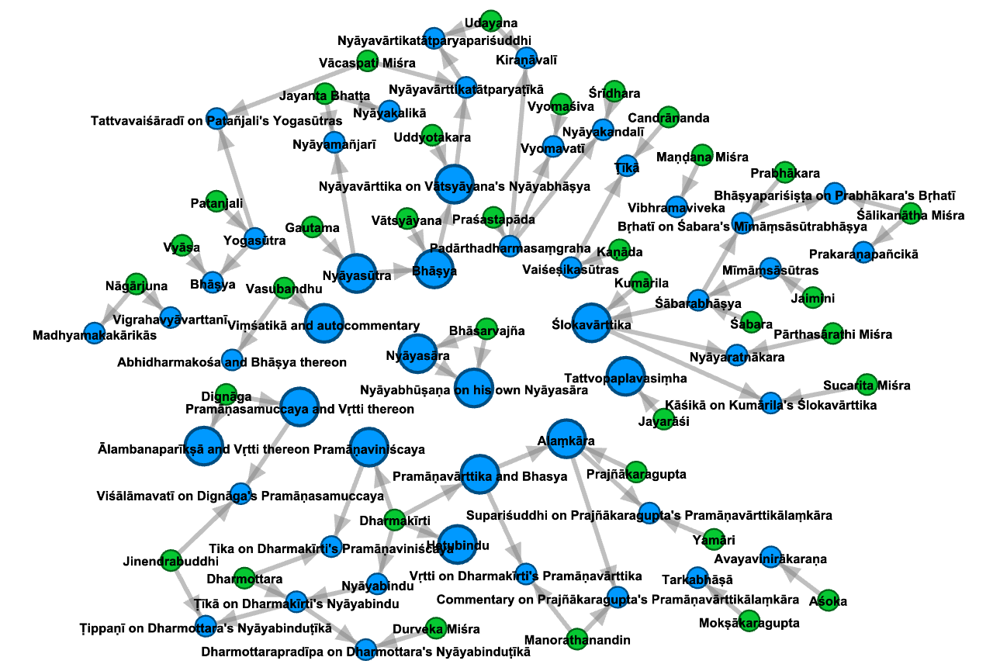
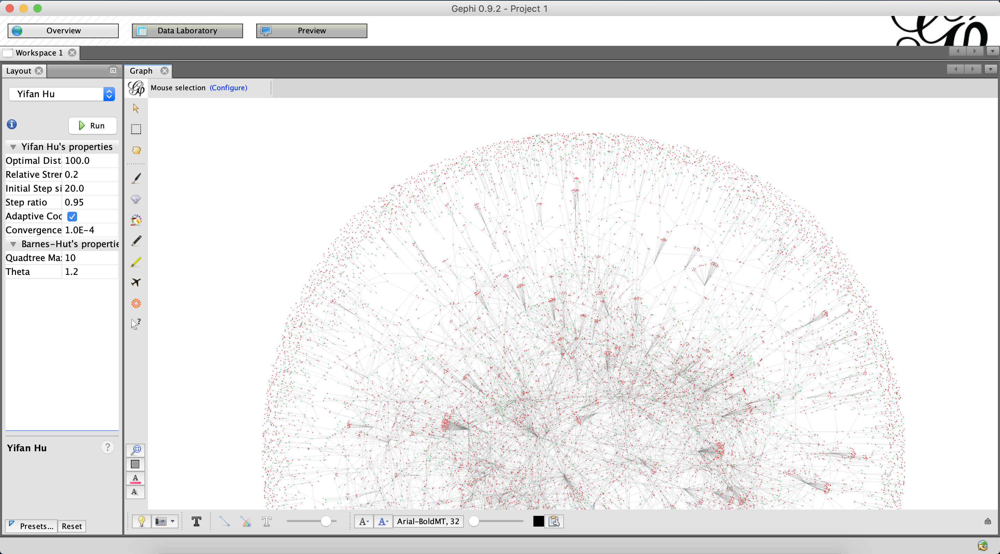
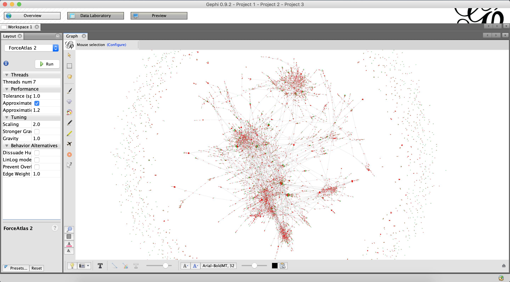

# Offline mode

These instructions for "offline mode" preserve Pandit Grapher v1 behavior.

By cloning and importing the code, you can use it locally to produce graph data for use with e.g. [Gephi](https://gephi.org/).
Resulting graphs are created in memory, (optionally) drawn to the screen with `networkx`, and also (optionally) output for Gephi.
More details on this are available <a href="https://github.com/tylergneill/pandit_grapher/tree/main/offline_mode.md">here</a>.

# Requirements

`pip install -r requirements_offline.in`

# How to Read Local `networkx` Results

If `draw_networkx_graph`  in `config.json` is set to `true`, 
an OS-native `networkx` pop-up window will appear with a “spring”-type, force-directed graph. 
Green circles are for persons, red circles are for works. 
Grey circles are for either persons or works whose further connections have been suppressed by the `exclude_list`. 
Lines indicate authorship or commentarial relationships, 
and arrows indicate causality, i.e., that a person "wrote" a work, or that one work "inspired" a further commentarial work.

It's also fine to use multiple entities to seed the `subgraph_center`. 
As long as there aren't errors or gaps in the database itself, 
the graph should connect itself up just fine. 
(Below is an example of doing so with Kālidāsa (ID: 40377), 
Vallabhadeva (ID: 96590), and Mallinātha Sūri (ID: 85731),
with 2020 data.) 

# Using the Gephi Output File

If `output_gephi_file` in `config.json` is set to `true`, 
an additional `.gexf` file compatible with the free third-party visualization software 
[Gephi](https://gephi.org/) will be generated in the `pandit_grapher` directory. 
This can be simply be opened in Gephi (`File` > `Open`) for more flexible graph visualization and manipulation there. 
For example, the “Yifan Hu” layout will produce a similar force-directed graph, 
and fiddling with the node, edge, and label appearances can quickly exceed what `networkx` can produce. 

The parts of the graph can also be moved around manually as needed, 
like in the below graph centering on Bhāsarvajña's Nyāyabhūṣaṇa and illustrating his intertextual influences.

Gephi is a bit old and can be buggy in my experience, 
but the software has an active user community, making it relatively easy to find answers to questions online.

# Doing Other Things with the Graph Data

The above calculation of the number of hops required to span the overall Pandit network 
is an example of doing things with the graph data other than just outputting parts of it for manual inspection. 
For more such analysis, optionally set the `draw_networkx_graph` and `output_gephi_file` variables in `config.json` to `false` 
and then just proceed to make use of the internal `networkx` graph object returned by `grapher.construct_subgraph()` — 
and perhaps also the `grapher.ENTITIES_BY_ID` dictionary which maps Pandit entity ID numbers to objects of the type defined in the `objects` module. 
For example, in Python interactive mode:

~~~
>>> import grapher as gr
>>> subgraph = gr.construct_subgraph(['40377'], 1)  # Kālidāsa
>>> print(subgraph.edges)
[('40377', '96246'), ('40377', '108950'), ('40377', '41324'), ('40377', '97244'), ('40377', '108721'), ('40377', '111609'), ('40377', '41500'), ('40377', '111635'), ('40377', '97243')]
>>>
>>> def summarize_building_of_n_hop_subgraph(subgraph_ctr, hops):
...     subgraph = gr.construct_subgraph(subgraph_ctr, hops)
...     last_node_id = list(subgraph.nodes)[-1]
...     last_node_str = "(last node: %s %s)" % (last_node_id, gr.ENTITIES_BY_ID[last_node_id].name)
...     print(hops, len(subgraph.nodes), last_node_str)
... 
>>> for num_hops in range(28):
...     summarize_building_of_n_hop_subgraph(['40377'], num_hops)
... 
0 1 (last node: 40377 Kālidāsa)
1 10 (last node: 97243 Vikramorvaśīya)
2 28 (last node: 108951 Ghaṭakarparavivṛti)
3 37 (last node: 96241 Pūrṇasarasvatī)
4 105 (last node: 41523 Upasargavṛtti)
5 139 (last node: 96249 Mālatīmādhava)
6 308 (last node: 85292 Utpala)
7 658 (last node: 90171 Tātparyacandrikā)
8 1658 (last node: 94234 Ṭippaṇa on Raṅgarāmānuja's Viṣayavākyadīpikā)
9 2861 (last node: 92856 Bhāvāratnakośa on Jayatīrtha's Tattvaprakāśikā)
10 4330 (last node: 86398 Bhairava Tilaka)
11 5778 (last node: 86843 Gaṅgānātha Jhā)
12 6584 (last node: 90163 Adhikaraṇaratnamālā)
13 7186 (last node: 92077 Upaniṣadarthasārasaṃgraha)
14 7835 (last node: 85952 Puṇyasāgara Gaṇi)
15 8215 (last node: 109787 Pariśiṣṭaprabodha)
16 8433 (last node: 90670 Commentary on a Pañcasūtra)
17 8629 (last node: 85400 Anantavīrya)
18 8727 (last node: 85203 Avalokitavrata)
19 8810 (last node: 88035 Milindapañha)
20 8866 (last node: 40386 Rudrabhaṭṭa)
21 8883 (last node: 85424 Vimalabuddhi)
22 8892 (last node: 89773 Ṭīkā on Anuruddha's Nāmarūpapariccheda)
23 8896 (last node: 85493 Mahābodhi)
24 8902 (last node: 89772 Ṭīkā on Khemappakaraṇa)
25 8905 (last node: 88912 Saccasaṃkhepa)
26 8906 (last node: 85267 Dhammapāla)
27 8906 (last node: 85267 Dhammapāla)
~~~

# Visualizing the Full Graph in Gephi

To construct the entire graph for visualization in Gephi,
simply run the script `construct_full_graph`.

~~~
python construct_full_graph.py
~~~

The output (2024 data) is also committed to the repo as `complete_graph.gexf`.

I recommended visualizing this graph in Gephi with the Yifan Hu and/or Force Atlas 2 layout algorithms.
(Screenshots below are with 2020 data.)

